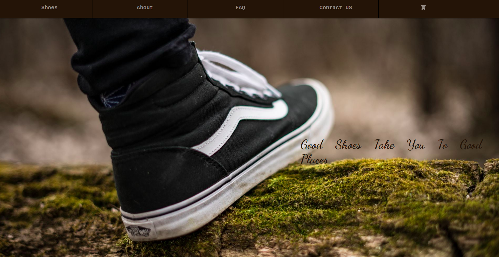
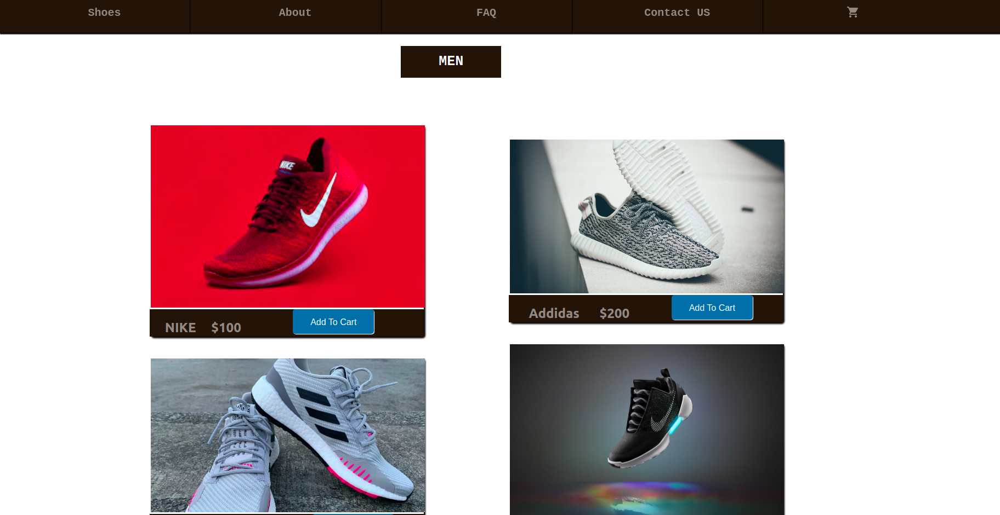
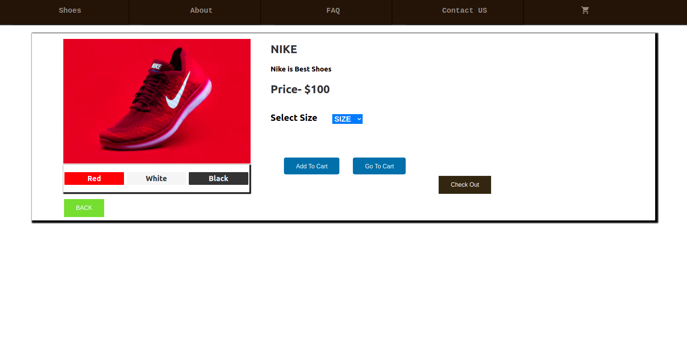
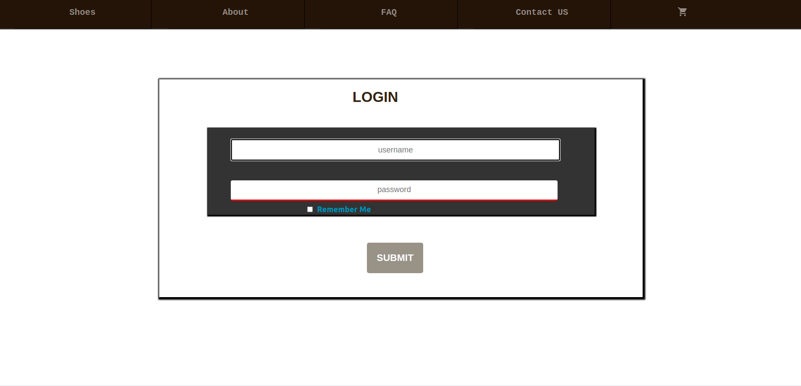
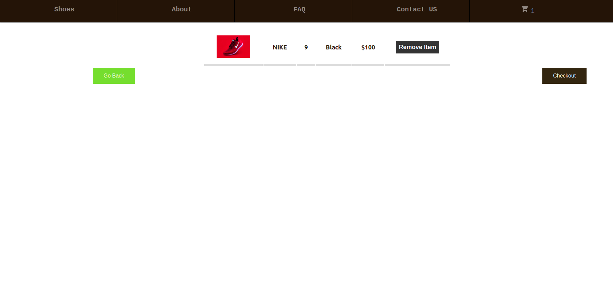
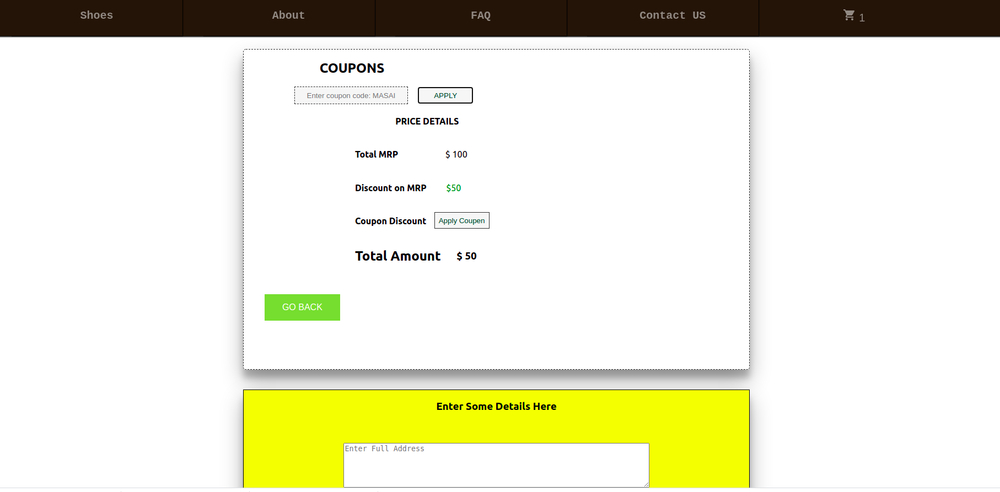
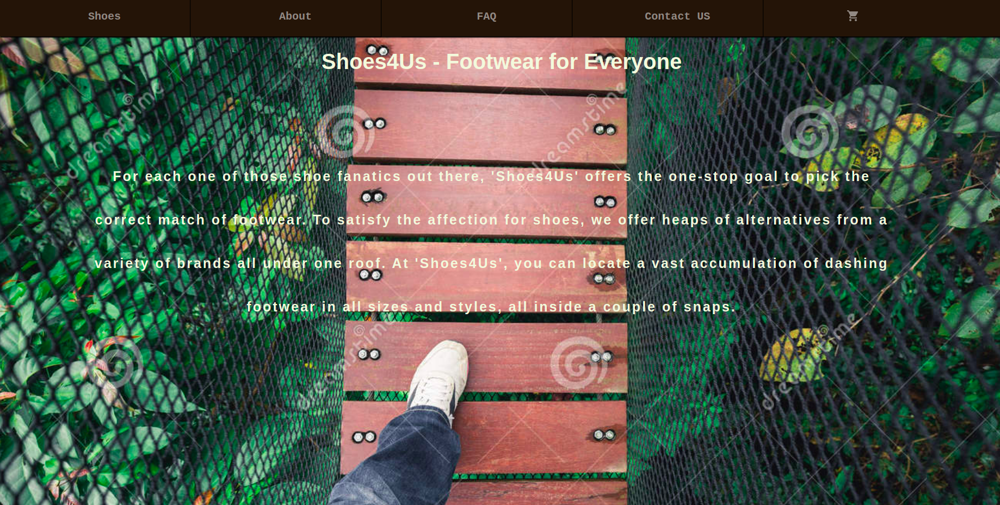
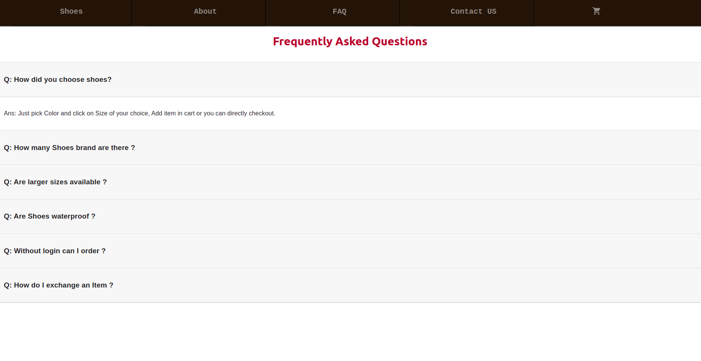
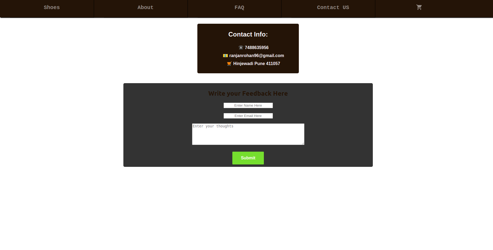

# shoes4Us

## This webiste basically for Shoes lovers, all top brands shoes you can get in one place.

### Technology

<ul>
<li>HTML
<li>CSS
<li>Javascript
<li>React
</ul>

### Main Page:

 
 

### Women Shoes:

 
 

### Men and Women sub section:

Here you can choose size and color of shoes.

 
 

### Login:

 
 

### Cart:

 
 

### Order:

Here you can apply coupon code (MASAI) for discount and fill the address details.

 
 

### About:

 
 

### FAQ:

 
 

### Contact:

Here you can send me feedback, i will get in my personal email.

 
 

<h3>Vist this link....
https://shoes4usrohan.netlify.app/contact
 
 

👤 Rohan Ranjan

 <ul>
 <li>Github : rohanranjan25061996 
 <li>Email : ranjanrohan96@gmail.com
 </ul>

 <h1></h1>
